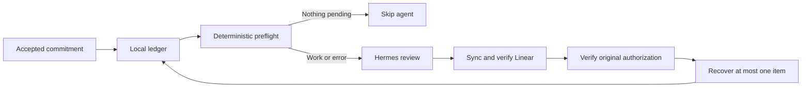

# Hermes Closeout

**Keep unfinished agent commitments from disappearing between sessions.**

Your agent says it will finish a report. The draft gets written, the session ends,
and verification or delivery never happens. Hermes Closeout keeps that commitment
in a durable ledger and brings it back through a bounded recovery workflow.

Built from a working Hermes commitment-tracking workflow.
This is an independent community project, not an official Nous Research product.

## Try it in 30 seconds

Python 3.11 or later. From this repository, run:

```console
python -m hermes_closeout.demo
```

No installation, accounts, API keys, or model calls needed. The demo uses fictional
data in a temporary directory and simulates Linear readback:

```text
1. Empty morning: {"wakeAgent": false}
2. Capture replay: 1 commitment, revision 1
3. Sync plan: 1 create; recovery waits for readback
   DEMO ONLY: simulating an external readback; no Linear request is made.
4. Recovery nominee: Deliver the sample report (authorization still required)
5. Verified closeout recorded: {"wakeAgent": false}
Temporary demo data removed on exit. No live agent or service was contacted.
```

## What it does

- **Persists accepted commitments:** owner, source session, unresolved work, next action, and revision.
- **Deduplicates exact capture:** replaying the same stable ID does not create another task or reopen canceled work.
- **Plans Linear synchronization:** create, update, or close actions with exact identity markers and bounded creation batches.
- **Checks sync receipts:** stale revisions, changed issue identities, and mismatched managed fields are rejected.
- **Nominates one recovery item:** outstanding sync work must be reconciled first; waiting and blocked items are review-only.
- **Skips empty mornings:** its read-only preflight emits Hermes's `wakeAgent` protocol without calling a model.



**The package supplies the ledger and gates.** Your Hermes agent and configured
Linear tools perform external synchronization, retrieve the original request,
verify permission, and execute the task. This release includes the integration
instructions; it does not include a Linear API client, conversation scanner,
scheduler installer, or autonomous task runner. A local receipt cannot prove that
a remote read actually occurred.

## Start a ledger

Optionally install the command with `python -m pip install .`. Runtime dependencies:
Python's standard library only. All commands below also work directly from the checkout.

```console
python -m hermes_closeout --ledger state/closeout.json init
python -m hermes_closeout --ledger state/closeout.json add --stable-id "demo:session-001:report" --summary "Deliver report" --why-unresolved "Verification and delivery remain" --next-action "Check the report against acceptance criteria" --owner "demo" --source-session "fictional-session-001"
python -m hermes_closeout --ledger state/closeout.json list
python -m hermes_closeout --ledger state/closeout.json --target examples/linear-target.json plan
python -m hermes_closeout --ledger state/closeout.json --target examples/linear-target.json preflight
```

`examples/linear-target.json` is fictional. Use it for local exploration only.
For real use, copy it to `local/linear-target.json` and supply your own team's,
project's, and labels' canonical identifiers as described in
[Hermes integration](docs/hermes-integration.md). Both `state/` and `local/` are ignored by Git.

Use `status --stable-id ID --status resolved` only after the outcome is verified
and delivered. Other statuses are `open`, `waiting`, `blocked`, `canceled`,
`parked`, and `snoozed`. Changing status is an explicit operator action;
capture replay alone never reopens an item.

## Connect to Hermes

Follow the [integration guide](docs/hermes-integration.md). It includes capture
rules, an explicit Linear readback contract, and a morning recovery prompt.

Hermes supports script gates that skip the agent when they emit
`{"wakeAgent": false}`. This project uses that existing interface; it does not
modify Hermes. See the [official scheduled-task documentation](https://hermes-agent.nousresearch.com/docs/user-guide/features/cron/#skipping-the-agent-entirely-wakeagent).

## Reliability and limits

Writes use a process lock and atomic replacement. Unknown or malformed state
wakes the agent with an error instead of silently declaring the queue empty.
See [design and trust boundaries](docs/design.md) for the state model and
[test coverage](docs/testing.md) for what is verified.

This is an early extraction. The offline flow is runnable; live Hermes/Linear
integration needs validation in the installer's environment. Notifications,
retry history, authorization checks, and execution ownership are enforced by the
integration workflow, not by a hidden background service.

## Development

```console
python -m unittest discover -s tests -v
python -m hermes_closeout.demo
```

CI is configured for Python 3.11 and 3.14 on Linux and Windows. A configured
matrix is not evidence those jobs have run. See [CONTRIBUTING.md](CONTRIBUTING.md).

## Origin and license

The original workflow combined source-time commitment capture, a persistent
ledger, a Linear closeout queue, and a morning recovery agent. This extraction
keeps its exact-ID tracking, status model, bounded aging, sync gates, and
empty-morning preflight. It removes machine-specific configuration and adds
stronger local validation and write protection. See [provenance](docs/provenance.md).

[MIT license](LICENSE).
